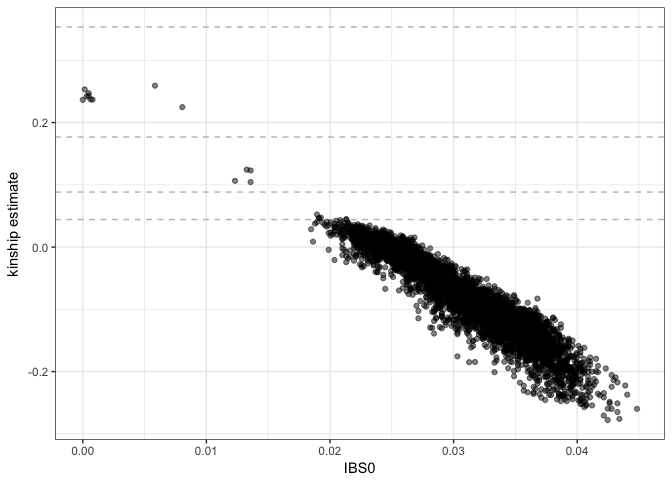
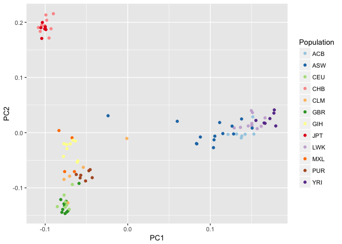

TOPMed Analysis Workshop
================

GDS format
==========

GDS is Genomic Data Structure, a storage format that can efficiently store genomic data and provide fast random access to subsets of the data. For more information on GDS for sequence data, read the [SeqArray package vignette](https://github.com/zhengxwen/SeqArray/blob/master/vignettes/SeqArrayTutorial.Rmd).

To use the R packages developed at the DCC for sequence data, we first need to convert a VCF file to GDS. (If the file is BCF, use [https://samtools.github.io/bcftools/bcftools.html](bcftools) to convert to VCF.)

``` r
library(SeqArray)
data.path <- "https://github.com/smgogarten/analysis_pipeline/raw/devel/testdata"
vcffile <- "1KG_phase3_subset_chr1.vcf.gz"
download.file(file.path(data.path, vcffile), vcffile)
gdsfile <- "1KG_phase3_subset_chr1.gds"
seqVCF2GDS(vcffile, gdsfile, fmt.import="GT", storage.option="LZMA_RA", verbose=FALSE)
```

We can interact with the GDS file using the SeqArray package.

``` r
gds <- seqOpen(gdsfile)
gds
```

    ## Object of class "SeqVarGDSClass"
    ## File: /projects/users/stephanie/Code/TOPMed/topmed_workshop_2017/1KG_phase3_subset_chr1.gds (70.3K)
    ## +    [  ] *
    ## |--+ description   [  ] *
    ## |--+ sample.id   { Str8 1126 LZMA_ra(9.66%), 877B } *
    ## |--+ variant.id   { Int32 1120 LZMA_ra(17.5%), 793B } *
    ## |--+ position   { Int32 1120 LZMA_ra(78.5%), 3.4K } *
    ## |--+ chromosome   { Str8 1120 LZMA_ra(4.55%), 109B } *
    ## |--+ allele   { Str8 1120 LZMA_ra(26.0%), 1.2K } *
    ## |--+ genotype   [  ] *
    ## |  |--+ data   { Bit2 2x1126x1121 LZMA_ra(8.34%), 51.4K } *
    ## |  |--+ extra.index   { Int32 3x0 LZMA_ra, 18B } *
    ## |  \--+ extra   { Int16 0 LZMA_ra, 18B }
    ## |--+ phase   [  ]
    ## |  |--+ data   { Bit1 1126x1120 LZMA_ra(0.11%), 177B } *
    ## |  |--+ extra.index   { Int32 3x0 LZMA_ra, 18B } *
    ## |  \--+ extra   { Bit1 0 LZMA_ra, 18B }
    ## |--+ annotation   [  ]
    ## |  |--+ id   { Str8 1120 LZMA_ra(40.4%), 3.6K } *
    ## |  |--+ qual   { Float32 1120 LZMA_ra(2.46%), 117B } *
    ## |  |--+ filter   { Int32,factor 1120 LZMA_ra(2.46%), 117B } *
    ## |  |--+ info   [  ]
    ## |  \--+ format   [  ]
    ## \--+ sample.annotation   [  ]

``` r
sample.id <- seqGetData(gds, "sample.id")
length(sample.id)
```

    ## [1] 1126

``` r
head(sample.id)
```

    ## [1] "HG00096" "HG00097" "HG00099" "HG00100" "HG00101" "HG00102"

``` r
variant.id <- seqGetData(gds, "variant.id")
length(variant.id)
```

    ## [1] 1120

``` r
head(variant.id)
```

    ## [1] 1 2 3 4 5 6

``` r
# define a filter to read a subset of data
seqSetFilter(gds, variant.id=1:10, sample.id=sample.id[1:5])
```

    ## # of selected samples: 5
    ## # of selected variants: 10

``` r
geno <- seqGetData(gds, "genotype")
dim(geno)
```

    ## [1]  2  5 10

``` r
geno[,,1:2]
```

    ## , , 1
    ## 
    ##       sample
    ## allele [,1] [,2] [,3] [,4] [,5]
    ##   [1,]    0    0    0    0    0
    ##   [2,]    0    0    0    0    0
    ## 
    ## , , 2
    ## 
    ##       sample
    ## allele [,1] [,2] [,3] [,4] [,5]
    ##   [1,]    0    0    0    0    0
    ##   [2,]    0    0    0    0    0

The [SeqVarTools package](http://bioconductor.org/packages/SeqVarTools) has some additional functions for interacting with SeqArray-format GDS files.

``` r
library(SeqVarTools)

getGenotype(gds)
```

    ##          variant
    ## sample    1     2     3     4     5     6     7     8     9     10   
    ##   HG00096 "0|0" "0|0" "0|0" "0|0" "0|0" "0|0" "0|0" "0|0" "0|0" "0|0"
    ##   HG00097 "0|0" "0|0" "0|0" "0|0" "0|0" "0|0" "0|0" "0|0" "0|0" "0|0"
    ##   HG00099 "0|0" "0|0" "0|0" "0|0" "0|0" "0|0" "0|0" "0|0" "0|0" "0|0"
    ##   HG00100 "0|0" "0|0" "0|0" "0|0" "0|0" "0|0" "0|0" "0|0" "0|0" "0|0"
    ##   HG00101 "0|0" "0|0" "0|0" "0|0" "0|0" "0|0" "0|0" "0|0" "0|0" "0|0"

``` r
refDosage(gds)
```

    ##          variant
    ## sample    1 2 3 4 5 6 7 8 9 10
    ##   HG00096 2 2 2 2 2 2 2 2 2  2
    ##   HG00097 2 2 2 2 2 2 2 2 2  2
    ##   HG00099 2 2 2 2 2 2 2 2 2  2
    ##   HG00100 2 2 2 2 2 2 2 2 2  2
    ##   HG00101 2 2 2 2 2 2 2 2 2  2

``` r
altDosage(gds)
```

    ##          variant
    ## sample    1 2 3 4 5 6 7 8 9 10
    ##   HG00096 0 0 0 0 0 0 0 0 0  0
    ##   HG00097 0 0 0 0 0 0 0 0 0  0
    ##   HG00099 0 0 0 0 0 0 0 0 0  0
    ##   HG00100 0 0 0 0 0 0 0 0 0  0
    ##   HG00101 0 0 0 0 0 0 0 0 0  0

``` r
refChar(gds)
```

    ##  [1] "C" "C" "C" "C" "T" "G" "G" "A" "A" "C"

``` r
altChar(gds)
```

    ##  [1] "G" "T" "T" "T" "C" "A" "A" "T" "C" "T"

Computing a GRM
===============

We can use the [SNPRelate package](https://github.com/zhengxwen/SNPRelate) to compute a Genetic Relationship matrix (GRM).

``` r
library(SNPRelate)
grm <- snpgdsGRM(gds, method="GCTA")
```

    ## Genetic Relationship Matrix (GRM, GCTA):
    ## Excluding 0 SNV on non-autosomes
    ## Excluding 14 SNVs (monomorphic: TRUE, < MAF: NaN, or > missing rate: NaN)
    ## Working space: 1,126 samples, 1,106 SNVs
    ##     using 1 (CPU) core
    ## GRM-analysis:    Thu Jun 15 16:30:12 2017    0%
    ## GRM-analysis:    Thu Jun 15 16:30:13 2017    100%

``` r
names(grm)
```

    ## [1] "sample.id" "snp.id"    "grm"

``` r
dim(grm$grm)
```

    ## [1] 1126 1126

``` r
seqClose(gds)
```

PC-Relate
=========

To disentangle ancestry from recent familial relatedness, we use the [PC-Relate](http://www.ncbi.nlm.nih.gov/pubmed/26748516) method.

Step 1 is to get initial estimates of kinship using [KING](http://www.ncbi.nlm.nih.gov/pubmed/20926424), which is robust to population structure but not admixture. The KING algorithm is available in SNPRelate. Typically we select a subset of variants for this calculation with LD pruning.

``` r
# use a GDS file with all chromosomes
gdsfile <- "1KG_phase3_subset.gds"
download.file(file.path(data.path, gdsfile), gdsfile)
gds <- seqOpen(gdsfile)

# use a subset of 100 samples to make things run faster
sample.id <- TopmedPipeline::getobj("samples_subset100.RData")

# LD pruning to get variant set
snpset <- snpgdsLDpruning(gds, sample.id=sample.id, method="corr", 
                          slide.max.bp=10e6, ld.threshold=sqrt(0.1))
```

    ## SNV pruning based on LD:
    ## Excluding 1,120 SNVs on non-autosomes
    ## Excluding 13,694 SNVs (monomorphic: TRUE, < MAF: NaN, or > missing rate: NaN)
    ## Working space: 100 samples, 10,946 SNVs
    ##     using 1 (CPU) core
    ##  Sliding window: 1e+07 basepairs, Inf SNPs
    ##  |LD| threshold: 0.316228
    ## Chromosome 1: 31.25%, 350/1120
    ## Chromosome 2: 31.16%, 349/1120
    ## Chromosome 3: 30.98%, 347/1120
    ## Chromosome 4: 30.89%, 346/1120
    ## Chromosome 5: 29.73%, 333/1120
    ## Chromosome 6: 30.89%, 346/1120
    ## Chromosome 7: 28.48%, 319/1120
    ## Chromosome 8: 25.54%, 286/1120
    ## Chromosome 9: 27.68%, 310/1120
    ## Chromosome 10: 28.57%, 320/1120
    ## Chromosome 11: 26.88%, 301/1120
    ## Chromosome 12: 28.48%, 319/1120
    ## Chromosome 13: 25.54%, 286/1120
    ## Chromosome 14: 24.11%, 270/1120
    ## Chromosome 15: 21.52%, 241/1120
    ## Chromosome 16: 22.41%, 251/1120
    ## Chromosome 17: 21.25%, 238/1120
    ## Chromosome 18: 23.30%, 261/1120
    ## Chromosome 19: 20.89%, 234/1120
    ## Chromosome 20: 20.00%, 224/1120
    ## Chromosome 21: 18.04%, 202/1120
    ## Chromosome 22: 17.95%, 201/1120
    ## 6334 SNPs are selected in total.

``` r
sapply(snpset, length)
```

    ##  chr1  chr2  chr3  chr4  chr5  chr6  chr7  chr8  chr9 chr10 chr11 chr12 
    ##   350   349   347   346   333   346   319   286   310   320   301   319 
    ## chr13 chr14 chr15 chr16 chr17 chr18 chr19 chr20 chr21 chr22 
    ##   286   270   241   251   238   261   234   224   202   201

``` r
pruned <- unlist(snpset, use.names=FALSE)

# KING
king <- snpgdsIBDKING(gds, sample.id=sample.id, snp.id=pruned)
```

    ## IBD analysis (KING method of moment) on genotypes:
    ## Excluding 19,426 SNVs (non-autosomes or non-selection)
    ## Excluding 0 SNV (monomorphic: TRUE, < MAF: NaN, or > missing rate: NaN)
    ## Working space: 100 samples, 6,334 SNVs
    ##     using 1 (CPU) core
    ## No family is specified, and all individuals are treated as singletons.
    ## Relationship inference in the presence of population stratification.
    ## Thu Jun 15 16:30:16 2017    (internal increment: 65536)
    ## 
    [..................................................]  0%, ETC: ---    
    [==================================================] 100%, completed      
    ## Thu Jun 15 16:30:17 2017    Done.

``` r
names(king)
```

    ## [1] "sample.id" "snp.id"    "afreq"     "IBS0"      "kinship"

``` r
dim(king$kinship)
```

    ## [1] 100 100

``` r
kingMat <- king$kinship
colnames(kingMat) <- rownames(kingMat) <- king$sample.id
```

We extract pairwise kinship estimates and IBS0 to plot.

``` r
kinship <- snpgdsIBDSelection(king)
head(kinship)
```

    ##       ID1     ID2       IBS0     kinship
    ## 1 HG00110 HG00116 0.02478686 -0.01184690
    ## 2 HG00110 HG00120 0.02620777 -0.02339004
    ## 3 HG00110 HG00128 0.02573413 -0.01644336
    ## 4 HG00110 HG00136 0.02873382 -0.04191981
    ## 5 HG00110 HG00137 0.02541838 -0.02308627
    ## 6 HG00110 HG00141 0.02826018 -0.04556501

``` r
library(ggplot2)
ggplot(kinship, aes(IBS0, kinship)) +
    geom_hline(yintercept=2^(-seq(3,9,2)/2), linetype="dashed", color="grey") +
    geom_point(alpha=0.5) +
    ylab("kinship estimate") +
    theme_bw()
```



The next step is [PC-AiR](http://www.ncbi.nlm.nih.gov/pubmed/25810074), in which we select a set of unrelated samples that is maximally informative about all ancestries in the sample. We use this unrelated set for Principal Component Analysis (PCA), then project the relatives onto the PCs.

First, we partition the samples into a related and unrelated set. We use a kinship threshold of degree 3 (unrelated is less than first cousins). We load the GENESIS package. In the first iteration, we use the KING estimates for both kinship (`kinMat`) and ancestry divergence (`divMat`). KING kinship estimates are negative for samples with different ancestry.

``` r
library(GENESIS)
sampset <- pcairPartition(kinMat=kingMat, kin.thresh=2^(-9/2),
                          divMat=kingMat, div.thresh=-2^(-9/2))
names(sampset)
```

    ## [1] "rels"   "unrels"

``` r
sapply(sampset, length)
```

    ##   rels unrels 
    ##     14     86

Typically we would repeat the LD pruning step on the set of unrelated samples we just identified, but for this example we will re-use the pruned set of variants from step 1. Using the SNPRelate package, we run PCA on the unrelated set and project values for the related set.

``` r
# run PCA on unrelated set
pca.unrel <- snpgdsPCA(gds, sample.id=sampset$unrels, snp.id=pruned)
```

    ## Principal Component Analysis (PCA) on genotypes:
    ## Excluding 19,426 SNVs (non-autosomes or non-selection)
    ## Excluding 220 SNVs (monomorphic: TRUE, < MAF: NaN, or > missing rate: NaN)
    ## Working space: 86 samples, 6,114 SNVs
    ##     using 1 (CPU) core
    ## Thu Jun 15 16:30:17 2017    (internal increment: 8712)
    ## 
    [..................................................]  0%, ETC: ---    
    [==================================================] 100%, completed      
    ## Thu Jun 15 16:30:18 2017    Begin (eigenvalues and eigenvectors)
    ## Thu Jun 15 16:30:18 2017    Done.

``` r
# project values for relatives
snp.load <- snpgdsPCASNPLoading(pca.unrel, gdsobj=gds)
```

    ## SNP loading:
    ## Working space: 86 samples, 6114 SNPs
    ##     using 1 (CPU) core
    ##     using the top 32 eigenvectors
    ## Thu Jun 15 16:30:18 2017    (internal increment: 65536)
    ## 
    [..................................................]  0%, ETC: ---    
    [==================================================] 100%, completed      
    ## Thu Jun 15 16:30:18 2017    Done.

``` r
samp.load <- snpgdsPCASampLoading(snp.load, gdsobj=gds, sample.id=sampset$rels)
```

    ## Sample loading:
    ## Working space: 14 samples, 6114 SNPs
    ##     using 1 (CPU) core
    ##     using the top 32 eigenvectors
    ## Thu Jun 15 16:30:18 2017    (internal increment: 65536)
    ## 
    [..................................................]  0%, ETC: ---    
    [==================================================] 100%, completed      
    ## Thu Jun 15 16:30:18 2017    Done.

``` r
# combine unrelated and related PCs and order as in GDS file
pcs <- rbind(pca.unrel$eigenvect, samp.load$eigenvect)
rownames(pcs) <- c(pca.unrel$sample.id, samp.load$sample.id)
samp.ord <- match(sample.id, rownames(pcs))
pcs <- pcs[samp.ord,]
```

We need to determine which PCs are ancestry informative. To do this we need population information for the 1000 Genomes samples. This information is stored in an `AnnotatedDataFrame`, which is a data.frame with optional metadata describing the colunms. The class is defined in the Biobase package. We load the stored object using the `getobj` function from the TopmedPipeline package.

``` r
library(Biobase)
sampfile <- "1KG_phase3_subset_annot.RData"
download.file(file.path(data.path, sampfile), sampfile)
annot <- TopmedPipeline::getobj(sampfile)
annot
```

    ## An object of class 'AnnotatedDataFrame'
    ##   rowNames: 1 2 ... 2504 (1126 total)
    ##   varLabels: sample.id family.id ... status (7 total)
    ##   varMetadata: labelDescription

``` r
head(pData(annot))
```

    ##   sample.id family.id Population          Population.Description sex
    ## 1   HG00096   HG00096        GBR British in England and Scotland   M
    ## 2   HG00097   HG00097        GBR British in England and Scotland   F
    ## 3   HG00099   HG00099        GBR British in England and Scotland   F
    ## 4   HG00100   HG00100        GBR British in England and Scotland   F
    ## 5   HG00101   HG00101        GBR British in England and Scotland   M
    ## 6   HG00102   HG00102        GBR British in England and Scotland   F
    ##     outcome status
    ## 1  8.580417      0
    ## 2 10.769515      1
    ## 3 10.428110      0
    ## 4 11.034979      1
    ## 5  9.706791      0
    ## 6 10.225198      0

``` r
varMetadata(annot)
```

    ##                                         labelDescription
    ## sample.id                              sample identifier
    ## family.id                              family identifier
    ## Population                       population abbreviation
    ## Population.Description            population description
    ## sex                                                  sex
    ## outcome                simulated random normal phenotype
    ## status                     simulated case/control status

We make a parallel coordinates plot, color-coding by 1000 Genomes population. We load the [dplyr](http://dplyr.tidyverse.org) package for data.frame manipulation.

``` r
pc.df <- as.data.frame(pcs)
names(pc.df) <- 1:ncol(pcs)
pc.df$sample.id <- row.names(pcs)

library(dplyr)
annot <- pData(annot) %>%
        select(sample.id, Population)
pc.df <- left_join(pc.df, annot, by="sample.id")

library(GGally)
library(RColorBrewer)
pop.cols <- setNames(brewer.pal(12, "Paired"),
                 c("ACB", "ASW", "CEU", "GBR", "CHB", "JPT", "CLM", "MXL", "LWK", "YRI", "GIH", "PUR"))
ggparcoord(pc.df, columns=1:12, groupColumn="Population", scale="uniminmax") +
    scale_color_manual(values=pop.cols) +
    xlab("PC") + ylab("")
```


The first 2 PCs separate populations, so we use them to compute kinship estimates adjusting for ancestry. The PC-Relate function expects a `SeqVarData` object, which allows linking sample and variant annotation with a GDS file in a single object. We will cover these in more detail later for association testing, but for now we create a bare object with no annotation.

``` r
seqResetFilter(gds, verbose=FALSE)
seqData <- SeqVarData(gds)

pcrel <- pcrelate(seqData, pcMat=pcs[,1:2], training.set=sampset$unrels, 
                  scan.include=sample.id, snp.include=pruned)
names(pcrel)
```

    ## [1] "sample.id"  "kinship"    "ibd.probs"  "nsnp"       "kincorrect"
    ## [6] "k2correct"  "call"       "freq.type"  "scale"

PC-Relate is an iterative method. Now that we have ancestry-adjusted kinship estimates, we can use them to better adjust for ancestry in the PCs. This time we use the `pcair` function, which combines partitioning the sample set and running PCA in one step. First we need to make a kinship matrix from the PC-Relate results. The KING matrix is still used for ancestry divergence.

``` r
pcrelMat <- pcrelateMakeGRM(pcrel, scaleKin=1)

pca <- pcair(seqData, v=32, 
             kinMat=pcrelMat, kin.thresh=2^(-9/2),
             divMat=kingMat, div.thresh=-2^(-9/2),
             scan.include=sample.id, snp.include=pruned)
names(pca)
```

    ##  [1] "vectors"    "values"     "sum.values" "rels"       "unrels"    
    ##  [6] "kin.thresh" "div.thresh" "nsamp"      "nsnps"      "MAF"       
    ## [11] "call"       "method"

``` r
pcs <- pca$vectors
pc.df <- as.data.frame(pcs)
names(pc.df) <- paste0("PC", 1:ncol(pcs))
pc.df$sample.id <- row.names(pcs)
pc.df <- left_join(pc.df, annot, by="sample.id")

ggplot(pc.df, aes(PC1, PC2, color=Population)) + geom_point() +
    scale_color_manual(values=pop.cols)
```



Now we use the revised PCs to compute new kinship estimates. One can run the iteration multiple times and check for conversion, but usually two rounds are sufficient.

``` r
pcrel <- pcrelate(seqData, pcMat=pcs[,1:2], training.set=pca$unrels, 
                  scan.include=sample.id, snp.include=pruned)
```

We plot the kinship estimates from PC-Relate, and notice that the values for less related pairs are much better behaved.

``` r
kinship <- pcrelateReadKinship(pcrel)

ggplot(kinship, aes(k0, kin)) +
    geom_hline(yintercept=2^(-seq(3,9,2)/2), linetype="dashed", color="grey") +
    geom_point(alpha=0.5) +
    ylab("kinship estimate") +
    theme_bw()
```


``` r
seqClose(gds)
```

Association tests
=================

Null model
----------

Single-variant tests
--------------------

Sliding window tests
--------------------

Variant annotation
==================

Defining aggregate units
------------------------

Association testing with aggregate units
----------------------------------------
